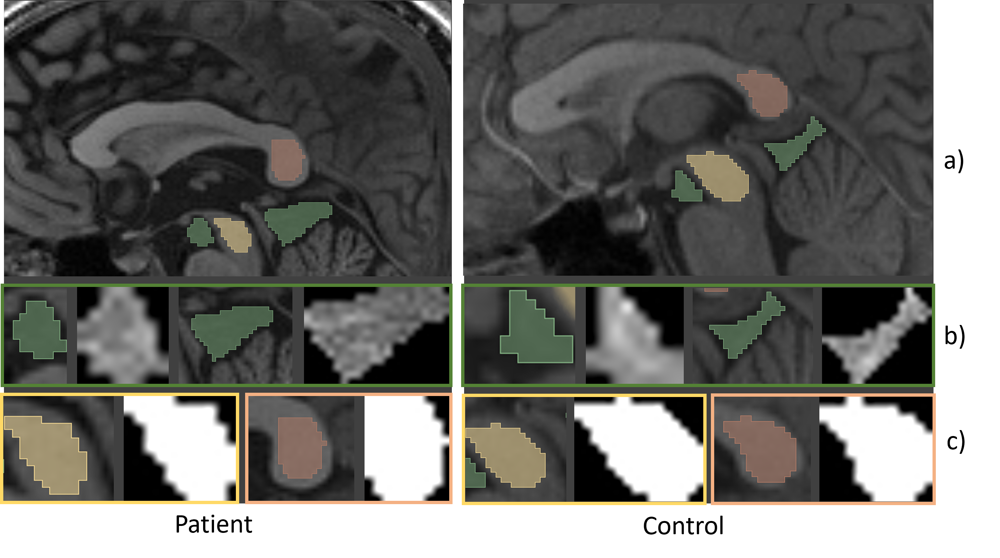
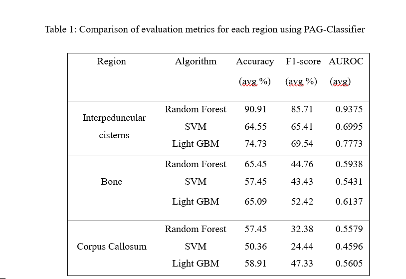
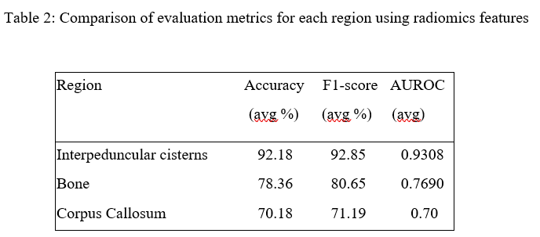
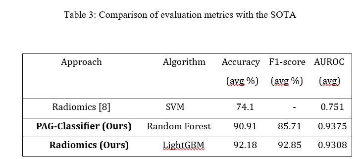

# Graph Based Method and Radiomics Signature for Identification of Tuberculous Meningitis

This repository is for code of Tuberculous Meningitis Classification on baseline and controls using a graph based approach and validation using a Radiomics approach. The related paper is at:

https://arxiv.org/abs/2504.00943 

## Project Contacts

Snigdha Agarwal (snigdha.agarwal@iiib.ac.in)
Jitender Saini (jsaini76@gmail.com)
Neelam Sinha (neelamsinha@iisc.ac.in)

## Security and Permissions

The data is internal to the researchers and authors on this work. Please write to the project contacts duly stating the purpose for access to this data.

## Set-Up

We used python 3.10.6 (e.g., `/Users/.virtualenvs/3.10.6/bin/python`)

#### Git clone

```commandline
git clone 
```

### Sample Data
Sample data is shown for one subject from the patients and contols group as below,




### Running the model (Graph Classification) for each region

```commandline
cd MI
```
The folder contains jupyter notebooks to run graph classification for each of bone, corpus callosum and interpeduncular cistern. THe folder also contains comparitive analysis code.

Disclaimer: This folder contains sample .npy files  for one subject in the Baseline and Control.

### Running the model for radiomics features classification

This folder contains sample extracted radiomics features for one subject in each of patients and control groups.


### Setting up virtualenv using venv (can use pipenv as well)

```commandline
python -m venv rad_tm
source rad_tm/bin/activate
cd Rad_TM
pip install -r requirements.txt
```

## Results

### Graph Based model with f1-score across all three regions is given below



### Comparison with radiomics approach is given below



### Comparison with sota 



